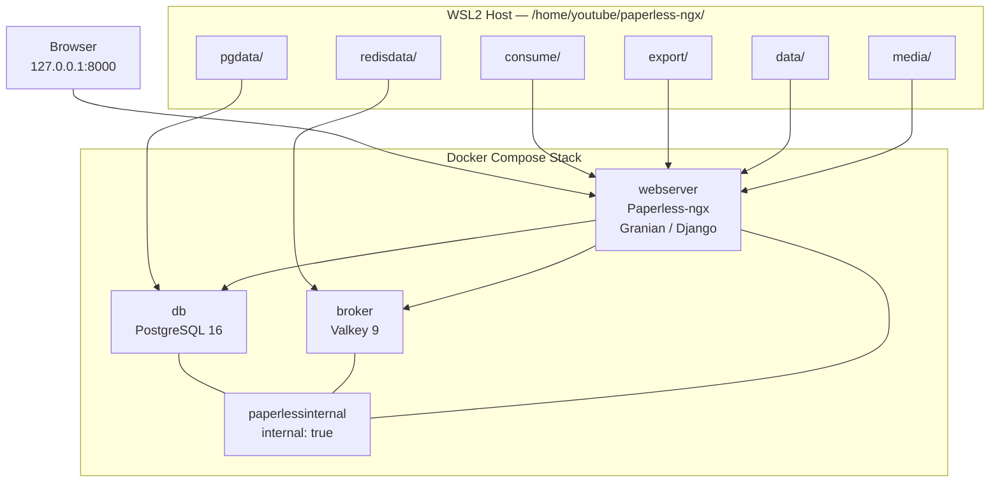

# Paperless-ngx on WSL2: Complete Companion Guide

Companion resource for the [NoCloudNeeded](https://github.com/NoCloudNeeded) video tutorial on deploying Paperless-ngx on WSL2 with an isolated Docker Compose stack — including the local AI narration pipeline used to produce the tutorial.

---

## 🏗️ Technical Framing & Architecture



### Architectural Decisions
| Aspect | Project Choice | Rationale |
| :--- | :--- | :--- |
| **Broker** | Valkey 9 (`valkey:9-alpine`) | Open-source Redis-protocol-compatible broker substitution for Celery queues. |
| **Database** | PostgreSQL 16 | Project pin to prevent SQLite concurrent write-lock errors (`db locked`) during multi-threaded OCR. |
| **Network** | `paperlessinternal` | Isolated internal bridge network (`internal: true`). Database and broker expose no host ports. |
| **Port Binding** | `127.0.0.1:8000:8000` | Loopback-only binding for local WSL2/Windows safety. |
| **Storage** | Host Bind Mounts | Inspectable directories under `/home/youtube/paperless-ngx/`. |

### Document Processing Behavior
- **Plain-Text Transcripts (`.txt`):** Indexed verbatim as searchable text. No OCR step is triggered.
- **PDFs & Scanned Images:** Routed through Tesseract OCR and converted to searchable PDF/A archives.

---

## 📋 1. Prerequisites

Run the following checks inside your WSL2 terminal:
```bash
docker --version
docker compose version
python3 --version
id -u
id -g
```

---

## 📁 2. Host Directory Structure

Create the project directories in WSL2:
```bash
mkdir -p /home/youtube/paperless-ngx/{data,media,consume,export,pgdata,redisdata}
cd /home/youtube/paperless-ngx
```

| Directory | Container Path | Purpose |
| :--- | :--- | :--- |
| `data/` | `/usr/src/paperless/data` | Application state, index files, and classifier models. |
| `media/` | `/usr/src/paperless/media` | Stored document files and generated PDF/A media. |
| `consume/` | `/usr/src/paperless/consume` | Ingestion drop folder (monitored for new files). |
| `export/` | `/usr/src/paperless/export` | Destination for `document_exporter` backup archives. |
| `pgdata/` | `/var/lib/postgresql` | PostgreSQL database storage. |
| `redisdata/` | `/data` | Valkey persistence directory. |

---

## ⚙️ 3. Environment Configuration

### Generate Secret Key
```bash
python3 -c "import secrets; print(secrets.token_hex(32))"
```

### Create `/home/youtube/paperless-ngx/.env`
```bash
# WSL2 host identity mapping (run id -u / id -g)
USERMAP_UID=1000
USERMAP_GID=1000

# Paperless-ngx Configuration
PAPERLESS_TIME_ZONE=America/New_York
PAPERLESS_SECRET_KEY=REPLACE_WITH_YOUR_GENERATED_64_CHARACTER_KEY
PAPERLESS_OCR_LANGUAGE=eng

# PostgreSQL Database
PAPERLESS_DBENGINE=postgresql
PAPERLESS_DBHOST=db
PAPERLESS_DBPORT=5432
PAPERLESS_DBNAME=paperless
PAPERLESS_DBUSER=paperless
PAPERLESS_DBPASS=REPLACE_WITH_A_STRONG_PASSWORD

POSTGRES_DB=paperless
POSTGRES_USER=paperless
POSTGRES_PASSWORD=REPLACE_WITH_A_STRONG_PASSWORD

# Valkey Message Broker
PAPERLESS_REDIS=redis://broker:6379
```

Add `.env` to `.gitignore`:
```bash
printf ".env\n" >> .gitignore
```

---

## 🐳 4. Docker Compose Configuration

Create `/home/youtube/paperless-ngx/docker-compose.yml`:
```yaml
services:
  broker:
    image: docker.io/valkey/valkey:9-alpine
    restart: unless-stopped
    volumes:
      - ./redisdata:/data
    networks:
      - paperlessinternal

  db:
    image: docker.io/library/postgres:16
    restart: unless-stopped
    volumes:
      - ./pgdata:/var/lib/postgresql
    environment:
      POSTGRES_DB: ${POSTGRES_DB}
      POSTGRES_USER: ${POSTGRES_USER}
      POSTGRES_PASSWORD: ${POSTGRES_PASSWORD}
    networks:
      - paperlessinternal

  webserver:
    image: ghcr.io/paperless-ngx/paperless-ngx:latest
    restart: unless-stopped
    depends_on:
      - db
      - broker
    ports:
      - "127.0.0.1:8000:8000"
    volumes:
      - ./data:/usr/src/paperless/data
      - ./media:/usr/src/paperless/media
      - ./consume:/usr/src/paperless/consume
      - ./export:/usr/src/paperless/export
    env_file:
      - .env
    environment:
      PAPERLESS_DBENGINE: ${PAPERLESS_DBENGINE}
      PAPERLESS_DBHOST: ${PAPERLESS_DBHOST}
      PAPERLESS_DBPORT: ${PAPERLESS_DBPORT}
      PAPERLESS_DBNAME: ${PAPERLESS_DBNAME}
      PAPERLESS_DBUSER: ${PAPERLESS_DBUSER}
      PAPERLESS_DBPASS: ${PAPERLESS_DBPASS}
      PAPERLESS_REDIS: ${PAPERLESS_REDIS}
      PAPERLESS_SECRET_KEY: ${PAPERLESS_SECRET_KEY}
      PAPERLESS_TIME_ZONE: ${PAPERLESS_TIME_ZONE}
      PAPERLESS_OCR_LANGUAGE: ${PAPERLESS_OCR_LANGUAGE}
      USERMAP_UID: ${USERMAP_UID}
      USERMAP_GID: ${USERMAP_GID}
    networks:
      - default
      - paperlessinternal

networks:
  default:
  paperlessinternal:
    driver: bridge
    internal: true
```

---

## 🚀 5. Launch & Verification

```bash
docker compose pull
docker compose up -d
docker compose ps
```

Create administrator credentials:
```bash
docker compose exec webserver python3 manage.py createsuperuser
```

Verify service health:
```bash
docker compose exec db pg_isready -U paperless
docker compose exec broker valkey-cli ping
```

---

## 🔍 6. Verified Demonstration Dataset

- **Transcript Ingestion:** `voicememo-ai-simulated.txt` placed in `consume/`.
- **Automated Workflow Tagging:** Matches filename `voicememo` $\rightarrow$ assigns tag `voice`, `tutorial`, `demo` and document type `Transcript`.
- **Saved Views:**
  - `Tutorial docs` $\rightarrow$ 5 documents
  - `Voice docs` $\rightarrow$ 5 documents
- **Full-Text Search:** Querying `simulated` directly isolates `voicememo-ai-simulated`.

---

## 🎙️ 7. Local AI Narration & Mastering (Kokoro-82M + FFmpeg)

```python
import subprocess, re, json
import soundfile as sf
import numpy as np
from kokoro import KPipeline

SAMPLE_RATE = 24000
pipeline = KPipeline(lang_code='a')

# 55% af_heart + 45% af_bella voice blend
v_heart = pipeline.load_voice('af_heart')
v_bella = pipeline.load_voice('af_bella')
blended_voice = 0.55 * v_heart + 0.45 * v_bella

text = """Paperless-ngx transforms physical documents into a searchable personal archive.

By pairing it with PostgreSQL and Valkey in Docker Compose, you eliminate database locking issues during heavy O-C-R ingestion.

Let us look at our saved views for Tutorial docs and Voice docs, run a search for simulated transcripts, and inspect the automated tags."""

chunks = list(pipeline(text, voice=blended_voice, speed=0.92, split_pattern=r'\n+'))
segments = []

for i, (_, _, audio) in enumerate(chunks):
    segments.append(audio)
    if i < len(chunks) - 1:
        segments.append(np.zeros(int(SAMPLE_RATE * 0.55), dtype=np.float32))

segments.append(np.zeros(int(SAMPLE_RATE * 0.4), dtype=np.float32))
raw_audio = np.concatenate(segments)
sf.write('raw_narration.wav', raw_audio, SAMPLE_RATE)

print('[1/2] TTS Synthesis Complete. Mastering with FFmpeg...')

# Pass 1: Measure loudness
cmd_pass1 = [
    'ffmpeg', '-y', '-i', 'raw_narration.wav',
    '-af', 'highpass=f=90,loudnorm=I=-14:TP=-1.0:LRA=7:print_format=json',
    '-f', 'null', '-'
]
res = subprocess.run(cmd_pass1, capture_output=True, text=True)
m = re.search(r'\{[\s\S]*\}', res.stderr)
stats = json.loads(m.group(0))

# Pass 2: Apply 2-pass Loudnorm & 48kHz upsampling
cmd_pass2 = [
    'ffmpeg', '-y', '-i', 'raw_narration.wav',
    '-af', (
        f'highpass=f=90,'
        f'loudnorm=I=-14:TP=-1.0:LRA=7:'
        f'measured_I={stats["input_i"]}:'
        f'measured_TP={stats["input_tp"]}:'
        f'measured_LRA={stats["input_lra"]}:'
        f'measured_thresh={stats["input_thresh"]}:'
        f'offset={stats["target_offset"]}:'
        f'linear=true'
    ),
    '-ar', '48000',
    '-ac', '1',
    'paperless_mastered_youtube.wav'
]
subprocess.run(cmd_pass2, check=True)
print('[2/2] SUCCESS! Mastered track saved: paperless_mastered_youtube.wav (-14.7 LUFS, 48kHz mono)')
```

---

## 💾 8. Backup & Restore Protocol

### Step 1: Export Documents & Metadata
```bash
docker compose exec -T webserver document_exporter /usr/src/paperless/export
```

### Step 2: Database Dump
```bash
docker compose exec -T db pg_dump -U paperless paperless > "paperless-db-$(date +%F).sql"
```

### Step 3: Isolated Restore Test
On a clean instance running the identical Paperless-ngx version:
```bash
docker compose exec -T webserver document_importer /usr/src/paperless/export
```
*Note: A successful export does not guarantee recovery until tested via a clean restore.*

---

## 🎬 9. Video Blueprint & YouTube Metadata

### Chapters
- `0:00` Why SQLite locks up during parallel OCR
- `0:45` Multi-container architecture overview
- `2:00` WSL2 folder setup & permission mapping (`id -u`)
- `4:00` `docker-compose.yml` walkthrough & startup
- `6:30` Voice memo transcript ingestion & automated tagging
- `8:00` Saved views (`Tutorial docs` / `Voice docs`) & search test
- `10:00` Local AI narration (Kokoro-82M + FFmpeg mastering)
- `12:00` Backup & restore testing with `document_exporter`
- `13:00` Wrap-up & repository resources

### Recommended Title
**Paperless-ngx on WSL2: Stop SQLite Lock Errors with Postgres + Valkey (Full Docker Guide)**

### Description
A complete, self-hosted Paperless-ngx setup on WSL2 — Docker Compose with PostgreSQL 16 and Valkey 9, fixing concurrent OCR write-lock errors. Covers WSL2 folder structure, UID/GID permission fixes, secret key generation, automated tagging workflows, search/saved-view verification, backup testing with document_exporter, and local narration generation with Kokoro TTS + FFmpeg loudness mastering.

Repository: https://github.com/NoCloudNeeded/paperless-ngx-wsl2-tutorial

#paperlessngx #selfhosted #docker #wsl2 #postgresql
