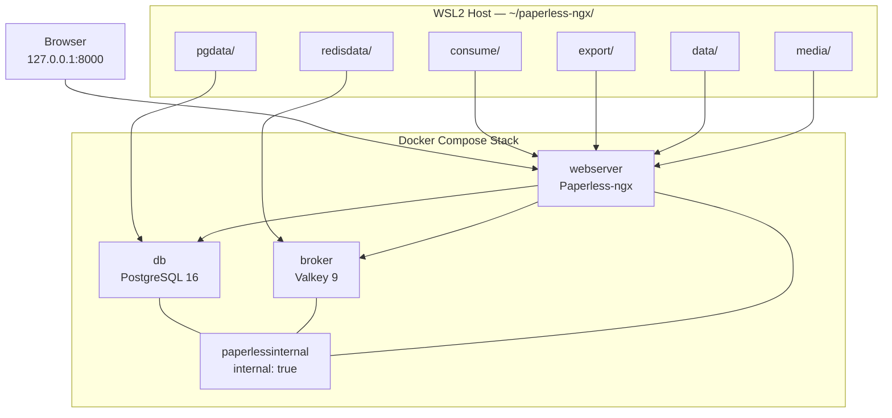

# Paperless-ngx on WSL2: Complete Companion Guide

Companion resource for the [NoCloudNeeded](https://github.com/NoCloudNeeded) video tutorial on deploying Paperless-ngx on WSL2 with an isolated Docker Compose stack.

***

## 🏗️ Technical Framing & Architecture



### Architectural Decisions

| Aspect | Project Choice | Rationale |
| :--- | :--- | :--- |
| **Broker** | Valkey 9 (`valkey:9-alpine`) | Open-source Redis-protocol-compatible broker for Celery queues. |
| **Database** | PostgreSQL 16 | Avoids SQLite concurrent write-lock errors during OCR and background processing. |
| **Network** | `paperlessinternal` | Isolated internal Docker network; database and broker expose no host ports. |
| **Port binding** | `127.0.0.1:8000:8000` | Limits the web interface to the local machine. |
| **Storage** | Host bind mounts | Data remains inspectable and portable under `~/paperless-ngx/`. |
| **Image version** | Pinned release tag | Use a tested official Paperless-ngx release instead of `latest` for reproducible deployments. |

### Document Processing Behavior

- Plain-text files are indexed as searchable text.
- PDFs and scanned images are processed with Tesseract OCR and converted into searchable archive documents.

***

## 📋 1. Prerequisites

Run these checks inside WSL2:

```bash
docker --version
docker compose version
id -u
id -g
```

***

## 📁 2. Host Directory Structure

```bash
mkdir -p ~/paperless-ngx/{data,media,consume,export,pgdata,redisdata}
cd ~/paperless-ngx
```

| Directory | Container Path | Purpose |
| :--- | :--- | :--- |
| `data/` | `/usr/src/paperless/data` | Application state, indexes, and classifier models. |
| `media/` | `/usr/src/paperless/media` | Original documents and generated archive media. |
| `consume/` | `/usr/src/paperless/consume` | Folder monitored for new documents. |
| `export/` | `/usr/src/paperless/export` | Destination for `document_exporter` archives. |
| `pgdata/` | `/var/lib/postgresql/data` | PostgreSQL database storage. |
| `redisdata/` | `/data` | Valkey persistence storage. |

***

## ⚙️ 3. Environment Configuration

Generate a secret key:

```bash
python3 -c "import secrets; print(secrets.token_hex(32))"
```

Create `~/paperless-ngx/.env`:

```env
# WSL2 host user mapping — replace with your own id -u and id -g values
USERMAP_UID=1000
USERMAP_GID=1000

# Paperless-ngx configuration
PAPERLESS_TIME_ZONE=Europe/Brussels
PAPERLESS_SECRET_KEY=REPLACE_WITH_YOUR_GENERATED_64_CHARACTER_KEY
PAPERLESS_OCR_LANGUAGE=eng

# PostgreSQL database
PAPERLESS_DBENGINE=postgresql
PAPERLESS_DBHOST=db
PAPERLESS_DBPORT=5432
PAPERLESS_DBNAME=paperless
PAPERLESS_DBUSER=paperless
PAPERLESS_DBPASS=REPLACE_WITH_A_STRONG_PASSWORD

POSTGRES_DB=paperless
POSTGRES_USER=paperless
POSTGRES_PASSWORD=REPLACE_WITH_A_STRONG_PASSWORD

# Valkey message broker
PAPERLESS_REDIS=redis://broker:6379
```

`PAPERLESS_DBPASS` and `POSTGRES_PASSWORD` must use the same value.

***

## 🐳 4. Docker Compose Configuration

Create `~/paperless-ngx/docker-compose.yml`:

```yaml
services:
  broker:
    image: docker.io/valkey/valkey:9-alpine
    restart: unless-stopped
    volumes:
      - ./redisdata:/data
    networks:
      - paperlessinternal

  db:
    image: docker.io/library/postgres:16
    restart: unless-stopped
    volumes:
      - ./pgdata:/var/lib/postgresql/data
    environment:
      POSTGRES_DB: ${POSTGRES_DB}
      POSTGRES_USER: ${POSTGRES_USER}
      POSTGRES_PASSWORD: ${POSTGRES_PASSWORD}
    networks:
      - paperlessinternal

  webserver:
    image: ghcr.io/paperless-ngx/paperless-ngx:2.14.7
    restart: unless-stopped
    depends_on:
      - db
      - broker
    ports:
      - "127.0.0.1:8000:8000"
    volumes:
      - ./data:/usr/src/paperless/data
      - ./media:/usr/src/paperless/media
      - ./consume:/usr/src/paperless/consume
      - ./export:/usr/src/paperless/export
    env_file:
      - .env
    environment:
      PAPERLESS_DBENGINE: ${PAPERLESS_DBENGINE}
      PAPERLESS_DBHOST: ${PAPERLESS_DBHOST}
      PAPERLESS_DBPORT: ${PAPERLESS_DBPORT}
      PAPERLESS_DBNAME: ${PAPERLESS_DBNAME}
      PAPERLESS_DBUSER: ${PAPERLESS_DBUSER}
      PAPERLESS_DBPASS: ${PAPERLESS_DBPASS}
      PAPERLESS_REDIS: ${PAPERLESS_REDIS}
      PAPERLESS_SECRET_KEY: ${PAPERLESS_SECRET_KEY}
      PAPERLESS_TIME_ZONE: ${PAPERLESS_TIME_ZONE}
      PAPERLESS_OCR_LANGUAGE: ${PAPERLESS_OCR_LANGUAGE}
      USERMAP_UID: ${USERMAP_UID}
      USERMAP_GID: ${USERMAP_GID}
    networks:
      - default
      - paperlessinternal

networks:
  default:
  paperlessinternal:
    driver: bridge
    internal: true
```

***

## 🚀 5. Launch & Verification

```bash
docker compose pull
docker compose up -d
docker compose ps
```

Create an administrator account:

```bash
docker compose exec webserver python3 manage.py createsuperuser
```

Check the database and broker:

```bash
docker compose exec db pg_isready -U paperless
docker compose exec broker valkey-cli ping
```

Open:

```text
http://127.0.0.1:8000
```

***

## 🔍 6. Test Document Ingestion

1. Sign in to Paperless-ngx.
2. Place a PDF or scanned document in `~/paperless-ngx/consume/`.
3. Wait for Paperless-ngx to process it.
4. Open the document and confirm:
   - OCR text is searchable.
   - Tags, correspondent, document type, and storage path can be assigned.
   - Full-text search returns the document.

For automated organization, create workflows in **Documents → Workflows**. For example, assign a tag when a filename contains a chosen pattern.

***

## 💾 7. Backup & Restore Protocol

### Export documents and metadata

```bash
docker compose exec -T webserver document_exporter /usr/src/paperless/export
```

### Create a PostgreSQL logical backup

```bash
docker compose exec -T db pg_dump -U paperless paperless > "paperless-db-$(date +%F).sql"
```

Protect the export directory, database dump, `.env`, and Compose configuration. Copy backups to separate storage; the local `export/` directory is a staging location, not a complete offsite backup.

### Test restoration

On a clean Paperless-ngx instance running the **same major version**:

```bash
docker compose exec -T webserver document_importer /usr/src/paperless/export
```

Verify that documents, metadata, tags, users, and search results were restored. A backup is only proven once it has been restored successfully.

***

## 📚 Repository Files

- `README.md` — this guide.
- `docker-compose.yml` — Paperless-ngx, PostgreSQL, and Valkey stack.
- `.env.example` — environment-variable template.
- `LICENSE` — MIT license.
